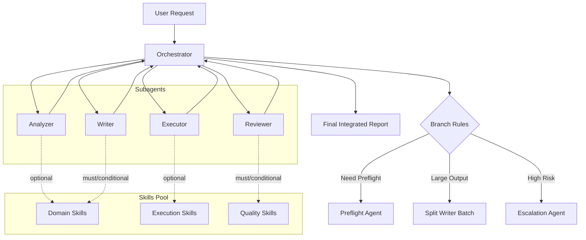
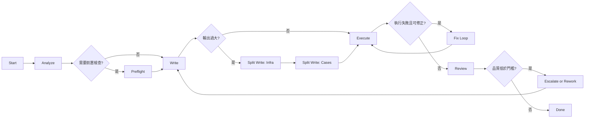

# Create 代理調度中心 Skill 規格（中性版）

本文件目的：將 references 的實作經驗抽象為可重用規格，用於建立「Create 代理調度中心」Skill。內容以架構與溝通協議為主，不綁定特定領域，可延伸到 API 開發流程、排程開發流程或其他任務管線。

## 1. 設計目標

1. 建立可治理的多代理協作模型（而非單代理全包）。
2. 用可演化的溝通協議降低資訊遺失與語意漂移（不綁死固定欄位）。
3. 允許依流程動態調整子代理鏈路（非固定單一路徑）。
4. 讓 Skills 成為可選擇載入的知識模組，而非硬綁在單一角色。

## 2. 參考範例圖

+ 核心架構圖 
+ 完整流程圖 

## 3. references 控制中心限制盤點

以下為從 references agents 實際定義萃取的控制面設計。

### 3.1 控制中心（Orchestrator）硬性限制

1. 角色定位固定為「分析、委派、整合」，不直接實作。
2. 明確禁止行為（HARD STOP）常見包含：
   - 直接讀取 SKILL.md。
   - 直接撰寫或修改業務/測試程式碼。
   - 直接執行 build/test。
   - 跳過既定流程階段。
3. 只允許使用輕量探索工具（read/search/listDirectory）組裝委派上下文。
4. 必須等待各子代理回傳後才能進入下一步。

### 3.2 子代理可見性與權限

1. Orchestrator 透過 agents 白名單限制可呼叫子代理集合。
2. 各 Subagent 使用 user-invocable: false，避免使用者繞過調度中心直接呼叫。
3. 工具權限依角色分層：
   - Analyzer：read/search 為主。
   - Writer：read/search/edit，可調整檔案。
   - Executor：read/search/edit + terminal/task，可建置執行。
   - Reviewer：read/search，僅審查回報。

### 3.3 執行治理規則

1. 流程順序預設為 Analyzer → Writer → Executor → Reviewer。
2. 多目標時常見策略：
   - Analyzer/Writer/Reviewer 可平行。
   - Executor 循序（避免 build 與環境資源衝突）。
3. 常見防呆分支：
   - 環境閘門（例如 Docker/workload）未通過即中止。
   - Writer 輸出長度超限時改為分批委派。
   - Executor 修正輪次超限後升級交由 Reviewer/人工決策。

## 4. 子代理溝通協議（非固定欄位）

本章重點：各子代理的輸入與輸出不需要固定 schema。調度中心真正要管理的是「順序、語義、可決策性」。

### 4.1 兩個硬條件（中心導向）

1. 下一站看得懂
   - 訊息必須讓下一個子代理能接手，不要求固定欄位名稱。
2. 調度中心能決策
   - 訊息必須提供足夠資訊讓 Orchestrator 判斷下一步（繼續、重試、分支、升級）。

### 4.2 最小語義單元（建議，不是固定欄位）

每次交接至少應具備以下語義，實際欄位可自由命名：

1. 目標語義：這次要處理什麼。
2. 結果語義：目前得到什麼。
3. 風險語義：有什麼阻塞或不確定。
4. 下一步語義：建議後續動作。

說明：

1. 可用 JSON、YAML、條列文字，格式不限。
2. 同一流程內可混用不同子代理格式，只要語義完整。
3. 調度中心負責做語義轉譯，不要求所有代理共享單一欄位模型。

### 4.3 順序性溝通範式（可套任意領域）

1. Analyze 階段
   - 交接重點：問題拆解、候選策略、已知風險。
2. Write 階段
   - 交接重點：產物位置、採用策略、前提假設。
3. Execute 階段
   - 交接重點：可執行結果、失敗點、修正建議。
4. Review 階段
   - 交接重點：品質判定、缺口、後續行動。

### 4.4 可演化協議規則

1. 允許版本演進
   - 不中斷既有流程的前提下新增語義欄位。
2. 允許角色特化
   - 不同領域子代理可定義自己的專屬輸出格式。
3. 允許流程插拔
   - 新增 Preflight/Security/Cost 類子代理時，不需重寫所有 I/O。

### 4.5 調度中心的協議責任

1. 管順序，不管格式統一。
2. 管語義完整，不管欄位命名一致。
3. 管決策可追溯：每次分支都能對應上一站回傳語義。
4. 管失敗可恢復：訊息不足時要求補件，而非直接中止整體流程。

## 5. Skills 調度策略（可由任一子代理選擇性呼叫）

為支援不同領域流程，建議將 Skills 載入規則改為策略化，而非只允許 Writer 載入。

### 5.1 載入層級

1. Must Load：該角色執行必備技能。
2. Conditional Load：符合條件才載入。
3. Optional Load：由子代理視情況選擇載入。
4. Forbidden Load：該角色明確禁載。

### 5.2 角色建議矩陣（中性範本）

1. Orchestrator：
   - 建議：禁止讀取細節型技能內容，只使用技能目錄索引或策略表。
2. Analyzer：
   - 可選：讀取分類/分析型技能（例如規則對照表、決策樹）。
3. Writer：
   - 必載：實作型技能。
4. Executor：
   - 可選：執行/除錯型技能（命令與故障排除手冊）。
5. Reviewer：
   - 必載：品質規範型技能。

### 5.3 調度中心的技能治理責任

1. 宣告每個角色可讀取的 skill scope。
2. 記錄每次實際 skillsLoaded，納入最終回報。
3. 防止技能過載：限制單輪載入數量，避免 Context 擁擠。

## 6. 可變流程模型（支援不同子代理流程）

不要把流程硬寫死成唯一四階段。建議採「核心主幹 + 條件分支」模型。

### 6.1 核心主幹

1. Analyze
2. Write
3. Execute
4. Review

### 6.2 常見條件分支

1. Preflight Gate
   - 在 Execute 前增加環境檢查（工具、憑證、容器、依賴服務）。
2. Split Write
   - 當輸出過大時，拆成「基礎設施批次」與「內容批次」。
3. Risk Escalation
   - 發現高風險（資安/資料/版本衝突）時插入專用子代理。
4. Retry Policy
   - Executor 固定輪次修正後失敗，改走人工決策或回寫 Writer。
5. Multi-target Mode
   - 多目標平行分析與撰寫，集中執行與審查。

## 7. 跨情境套用範例（中性）

### 7.1 API 開發流程

可用子代理鏈：

1. Requirement Analyzer
2. Contract Writer（OpenAPI/DTO）
3. Implementation Writer
4. Build/Test Executor
5. Quality Reviewer

可選分支：

1. Security Reviewer
2. Performance Reviewer

### 7.2 排程開發流程

可用子代理鏈：

1. Job Analyzer（觸發條件、依賴、時區）
2. Workflow Writer（排程定義、錯誤補償）
3. Runtime Executor（dry-run、整合驗證）
4. Reliability Reviewer（重試、冪等、告警）

可選分支：

1. Capacity Planner
2. Cost Reviewer

## 8. Create 調度中心 Skill 落地建議

建議輸出成以下結構：

```text
.github/
  agents/
    create-orchestrator.agent.md
    create-analyzer.agent.md
    create-writer.agent.md
    create-executor.agent.md
    create-reviewer.agent.md
  skills/
    create-orchestration/
      SKILL.md
      references/
        role-boundary.md
            communication-semantics.md
        branching-playbook.md
  prompts/
    create-orchestration.prompt.md
```

SKILL.md 應至少包含：

1. 角色定義與權限邊界。
2. 溝通語義與交接規則（非固定欄位）。
3. 流程主幹與條件分支規則。
4. 技能載入策略（Must/Conditional/Optional/Forbidden）。
5. 失敗處理與升級路徑。

## 9. Mermaid 架構圖（中性調度中心）



## 10. Mermaid 流程圖（可變子代理路徑）



## 11. 參考來源

+ 系列：從鐵人賽到 Agent Orchestration — AI 自動建立 .NET 測試的完整方案
  1. [從鐵人賽 30 天到 29 個 Agent Skills — 背景、願景與知識體系](https://dotblogs.com.tw/mrkt/2026/03/01/220251)
  2. [Skills 的觸發困境與 Custom Prompts 的過渡方案](https://dotblogs.com.tw/mrkt/2026/03/03/000250)
  3. [VS Code v1.109 與 Agent Orchestration 的登場 — 遊戲規則的改變](https://dotblogs.com.tw/mrkt/2026/03/07/141556)
  4. [dotnet-testing-orchestrator 架構解析 — 1 個 Orchestrator + 4 個 Subagents](https://dotblogs.com.tw/mrkt/2026/03/08/115819)
  5. [dotnet-testing-orchestrator 四階段流程深入解析 — 運作機制與實戰演示](https://dotblogs.com.tw/mrkt/2026/03/08/145906)
+ [dotnet-testing-agent-orchestration](https://github.com/kevintsengtw/dotnet-testing-agent-orchestration)
+ [copilot-orchestra](https://github.com/ShepAlderson/copilot-orchestra)
+ [Github-Copilot-Atlas](https://github.com/bigguy345/Github-Copilot-Atlas)
